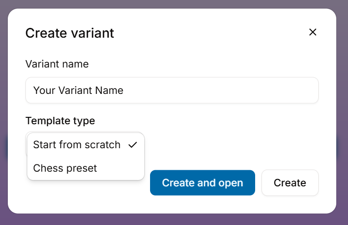

# Creating a variant

You can create a variant by clicking on the "Create Variant" button.

<figure><figcaption></figcaption></figure>

All you need to do is to input the **variant name** and **template type**.

> Templates are pre-designed variants which you can based your own variants off from.

#### Types of templates:

* **Start from scratch**: Absolutely nothing provided. Create something completely new.
* **Chess preset**: The classic and original game of chess. Best if you want to make slight modifications to the base game.

### And you are done!

Either click "Create and open" to start working on your new variant immediately or just "Create" to work on it another time.

