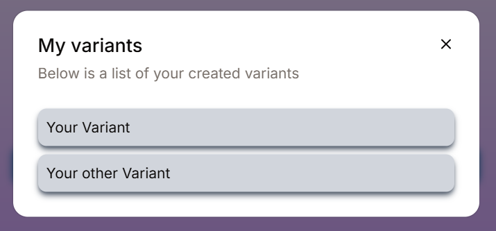
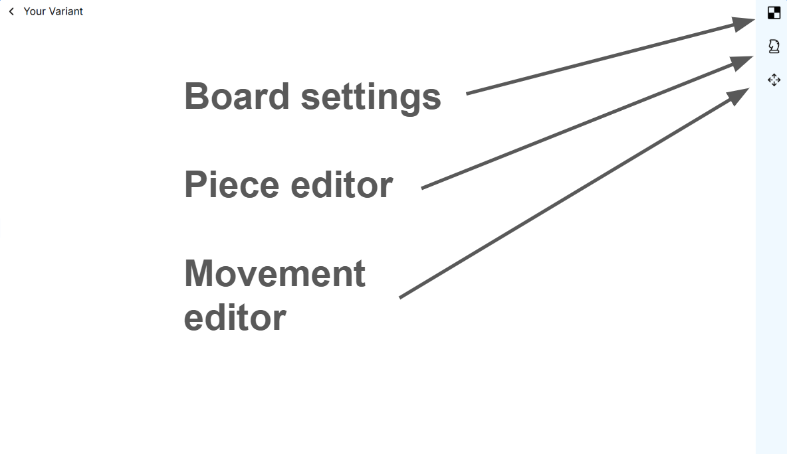

# Variant Editor

The variant editor can be accessed from either after creating and opening a new variant or selecting a variant through the "My variants" button.

<figure><figcaption>
What you should see after clicking the "My variant" button
</figcaption></figure>

## Inside the variant editor

<figure><figcaption></figcaption></figure>

### The main sections

In the variant editor, there are **3 main sections** where you can customise and configure your own variant

* **Board settings**: Customising the board.
* **Piece editor**: Adding and customising your pieces
* **Movement editor**: Adding and customising the movements of your pieces
