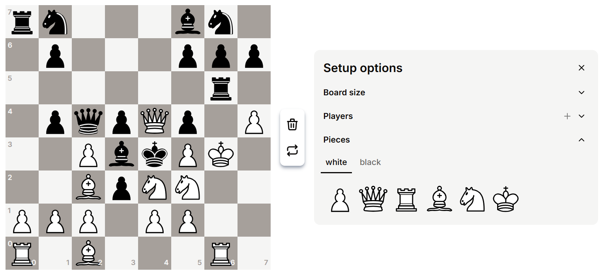
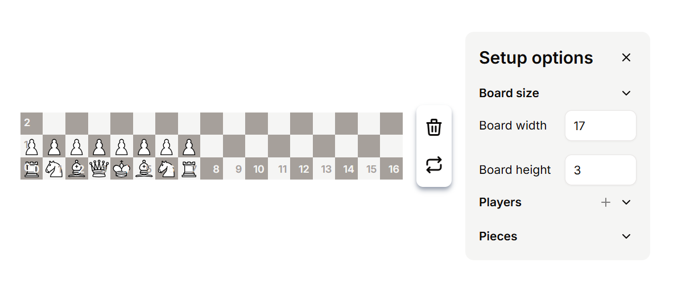
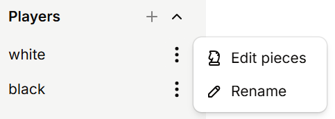
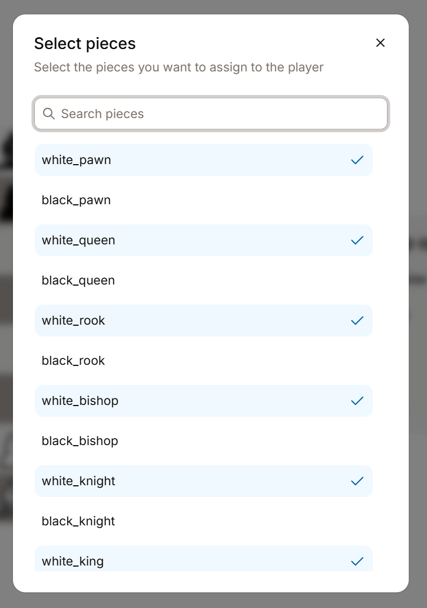

# Board Settings

## Main functionalities

The board settings page has 3 main functionalities:

* Editing your variant's starting position
* Editing the board size
* Editing the players and their pieces

***

### Start position

In every game of chess, all the pieces start in the same position. Here, you can create your own starting position, with the pieces you have created.

<figure><figcaption>
Go wild
</figcaption></figure>

You can drag pieces from each player onto the board to create any sort of starting position.

***

### Editing the board size

<figure><figcaption>
Go crazy
</figcaption></figure>

You can set the board width and height to any number from **1 to 32**.


Tip: Set your board width and height first, as changing it at the end may mess up with some of your piece placements.


***

**Note: The features mentioned below have no real purpose yet, but they will be given one in the near future!**

***

### Editing the players

<figure><figcaption></figcaption></figure>

> Players are the people that will be playing the game. In the future, it will control the turn order and the pieces each player can control.

Click the "+" button to add a new player _(currently limited to 2 players)_. You can click the 3 dot button to either rename a player or edit the pieces it can control _(no current purpose **yet**)._

<figure><figcaption>
Choose which pieces belong to this player
</figcaption></figure>


Each piece doesn't have to be strictly controlled by a single player! You can also have pieces which no player can control, or are controlled by 2 or more players. This can make variants much more interesting!

