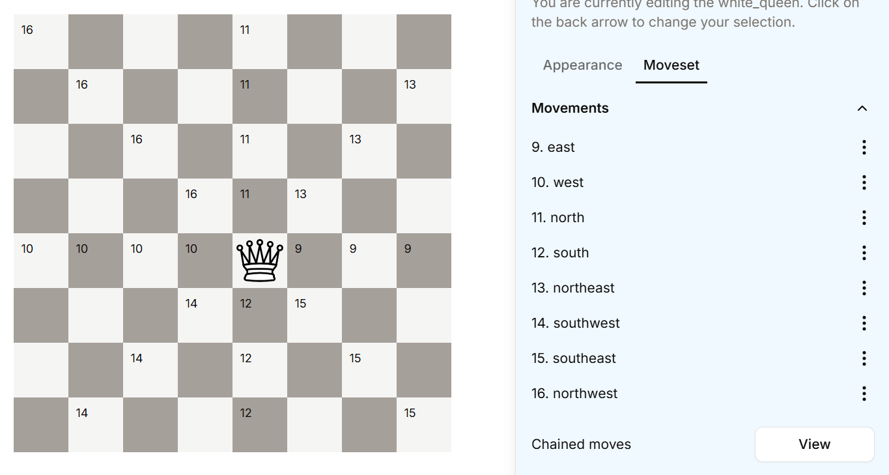

# Examples And Explanations

Here, we will be looking at some familiar chess-like pieces, and how you could recreate them with our features in the variant editor.

***

## Queen

Though the queen is described as the strongest piece in international chess, its setup in the variant editor is **relatively simple**.

<figure><figcaption>
Finally, movements that are properly named
</figcaption></figure>

As you can see in the image, the queen is made up of **8 movements**, one for each direction it can travel in.

### The movements

Let's look at one of its movements: **southeast**.

<figure><figcaption></figcaption></figure>

In the movement editor, we can see that it is a move that allows for both **movement and capture**. Its move vector definition is (1, -1), and its range is set to **Unlimited**. This means it travels in steps of moving **right (X = 1)** and **down (Y = -1)**, infinitely.

The rest of the moves for the queen is pretty much the same, except that the move vector, which controls which direction it travels in.

***

## Pawn

Despite being the weakest piece in international chess, it is actually the most complex piece to make amongst all of the traditional pieces.

<figure><figcaption></figcaption></figure>

Here, you can see that the pawn has 2 regular movements, along with a singular chained move sequence, containing 2 movements.


Note: The piece preview does not have the functionality to display for-capture only pieces, this will be added in very soon in a future update.


<figure><figcaption></figcaption></figure>

### The regular movements

Firstly, the two capture-only movements, the ones for capturing pieces left and right. They have a range of 1 and their move vectors are (-1, 1) and (1, 1) respectively for left and right.

However, the most important part is this:

<figure><figcaption></figcaption></figure>

This makes it so that the pawn can only move diagonally forward if there's a piece it can capture on that square, and not just be able to move at will.

### The chained moves

The chained move sequence consists of 2 movements, one that moves **forward one square** and another that moves **forward one square**. But wait, don't they do the same thing? Why can't you just make it a singular move that has a vector of (0, 1) and a range of 2?

<figure><figcaption></figcaption></figure>

The reason for this design is actually **quite simple**. In traditional chess, the pawn only can move one step forward, except if it **has not moved yet**, which then lets it **move two steps forward**. This is implemented here by having a normal forward movement, then chaining a another forward movement that is **only allowed on the first move**.


Tip: You can explore how the other traditional chess pieces can be constructed by creating a variant with the "Chess Preset" template, and then exploring it.


***

## Pieces from popular chess variants
