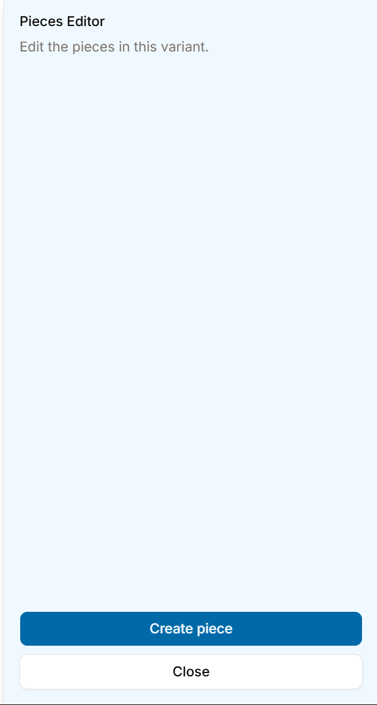
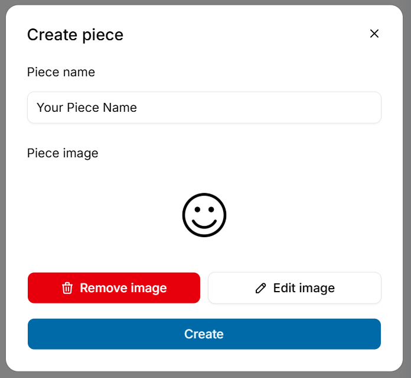

# Piece Editor

## How to create a piece

<figure><figcaption>
Looking a bit empty
</figcaption></figure>

On the right of the screen, you should see this. Click the **"Create piece"** button to create your very first piece.

<figure><figcaption>
It looks happy
</figcaption></figure>

Name your piece to **whatever you want**, and then add **any image**!

<i class="fa-triangle-exclamation">:triangle-exclamation:</i> Warning: Adding an image when creating a piece is compulsory. Should there not be an image provided for any reason, the piece image will be set to the default image.

<figure><figcaption>
Very striking default image
</figcaption></figure>

<figure><figcaption>
Still very happy
</figcaption></figure>

Upon creation, you should be seeing this. On the appearance page, you can change your piece name and also upload a new image for it.


Note: No 2 pieces can share the same name.


### Piece Movements

This is probably the **most important aspect** of every piece. Here, you control how the piece **moves and behaves**.

<figure><figcaption></figcaption></figure>

Currently, your piece has no movements! Let's move on to the next page to learn how to create movements for your pieces.
